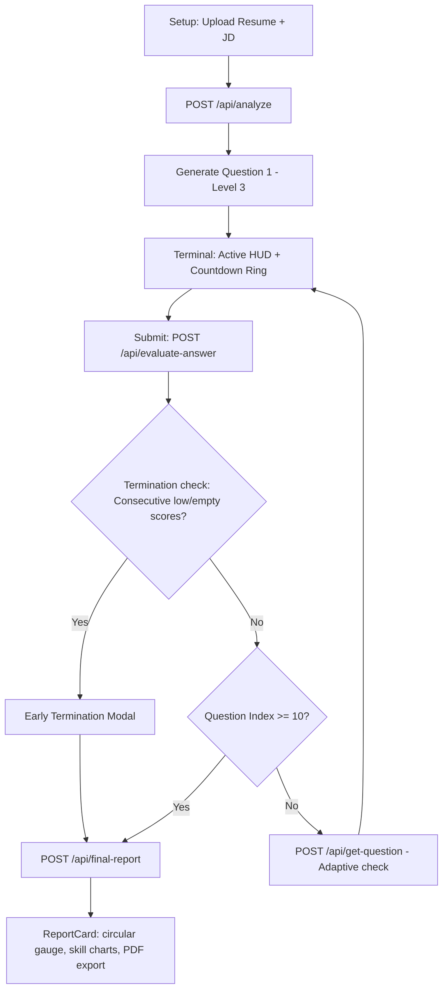

# Hack2Hire — AI-Powered Mock Interview Platform


*Banner: A dark themed, futuristic, high-contrast digital war room terminal showing compiled skill metrics with the title "Hack2Hire — AI Mock Interview Platform".*

---

### 💡 The Problem It Solves
Technical candidates struggle to practice for interviews under realistic, high-pressure constraints that mimic the adaptive questioning of senior engineering managers. Hack2Hire solves this by providing a premium, dark-themed "war room" dashboard where an AI interviewer adapts difficulty dynamically in real-time, penalizes slow responders, and evaluates answers on technical depth and communication clarity.

---

### 🚀 Tech Stack Badges


---

### 🌟 Key Features
- **📄 Client-Side Resume Parsing**: Instantly read PDF, DOCX, or text resume files locally on your browser (powered by `pdf.js` and `mammoth.js`).
- **🎯 Dynamic Profile Match**: Evaluates your background against target JDs to identify matching skills, estimated experience, and role fit % before starting.
- **⚡ Adaptive Questioning**: AI interviewer escalates difficulty to `hard` if you answer exceptionally well (scores > 75) and downscales to `easy` if scores drop.
- **⏱️ Strict Time Constraints**: Countdown timer circle (SVG) turns red and pulses in the last 15s. Running overtime applies a server-side penalty of 0.5 points per second.
- **🧠 5-Metric Scoring Engine**: Scores responses out of 100 based on Accuracy (25), Clarity (20), Depth (25), Relevance (20), and Time Efficiency (10).
- **🚨 Emergency Termination**: Halts sessions immediately if performance drops below 35% for 3 consecutive questions or if 2 consecutive answers are empty.
- **📊 Circular Score Gauge & Sparklines**: Beautiful animated dashboard showing difficulty trajectory sparklines, chronological timeline reviews, and action plan steps.
- **📋 PDF Report Exporter**: Download your final assessment scorecard as a PDF document with a single click.

---

### 🛠️ Architecture Diagram



---

### 📝 Setup Instructions

#### 1. Clone the repository and install dependencies
```bash
# Clone the repository
git clone https://github.com/your-username/hack2hire.git
cd hack2hire

# Install backend dependencies
cd backend
npm install

# Install frontend dependencies
cd ../frontend
npm install
```

#### 2. Configure Environment Variables
Create a `.env` file in the `backend/` directory:
```env
PORT=5001
ANTHROPIC_API_KEY=your_claude_api_key_here
```
*(If no API key is supplied, Hack2Hire automatically runs in **Simulator Mode** so you can test the entire flow offline.)*

#### 3. Run Development Servers
Start the backend server:
```bash
cd backend
npm run dev
```
*(Starts on `http://localhost:5001`)*

Start the frontend Vite server:
```bash
cd ../frontend
npm run dev
```
*(Starts on `http://localhost:5173`)*

---

### 🔄 How It Works (5-Step Flow)
1. **Dossier Calibration**: Candidate uploads their resume and pastes a Job Description.
2. **Analysis Handshake**: The engine extracts name, experience, matching skills, and matches qualifications against JD parameters.
3. **Adaptive Question Pipeline**: The platform fires the first question (Technical). The timer starts ticking.
4. **Answer Evaluation**: The candidate types their code or explanation. Upon submission, Claude grades the text and calibrates next question difficulty.
5. **Scorecard Compilation**: Once 10 questions are completed (or early termination is triggered), the system compiles a detailed breakdown with a PDF download option.

---

### 📊 Scoring System Explanation

| Criteria | Weight | Notes |
|----------|--------|-------|
| **Accuracy** | 25pts | Factual correctness of statements, coding syntax, and architecture choices. |
| **Clarity** | 20pts | Structured explanation, readability, communication structure, and grammar. |
| **Depth** | 25pts | Highlighting engineering trade-offs, edge-cases, and architectural trade-offs. |
| **Relevance** | 20pts | Focus on the question topic, alignment with job description requirements. |
| **Time Efficiency** | 10pts | Quick responses earn full points. Overtime deducts 0.5 points/sec from total. |

*Note: Answers under 20 words are capped at a maximum score of 5 points.*

---

### 📸 Screenshots
*(Screenshot placeholders showing the Landing configure screen, Live terminal panel, and Final Assessment dashboard)*
- [Landing / Uploader Screen Preview](https://via.placeholder.com/600x350/0D0D0F/00D4FF?text=Hack2Hire+Landing+Screen)
- [Live Terminal HUD Screen Preview](https://via.placeholder.com/600x350/0D0D0F/FFB800?text=Hack2Hire+Live+Terminal+HUD)
- [Final Report Card Screen Preview](https://via.placeholder.com/600x350/0D0D0F/00FF88?text=Hack2Hire+Final+Report+Card)

---

### 🎥 Video Demo
*(Place screen recording link here)*
- [Hack2Hire Live Walkthrough Demo Video](https://via.placeholder.com/600x350/0D0D0F/FFFFFF?text=Hack2Hire+Video+Walkthrough+Demo)

---

### ⚖️ License
This project is licensed under the MIT License - see the LICENSE file for details.
