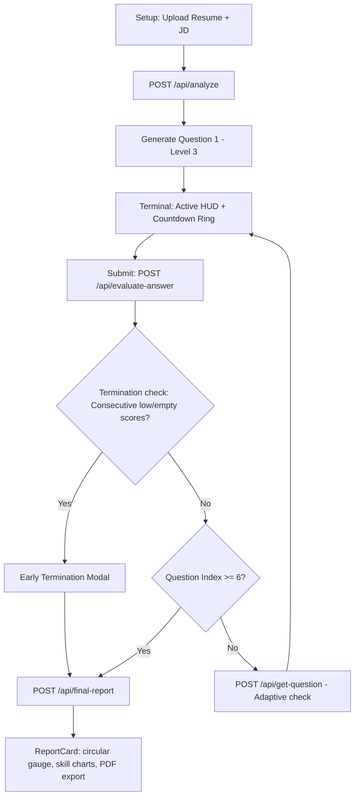
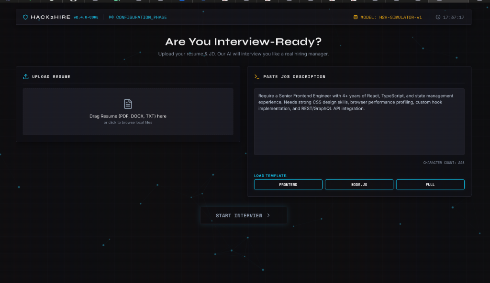
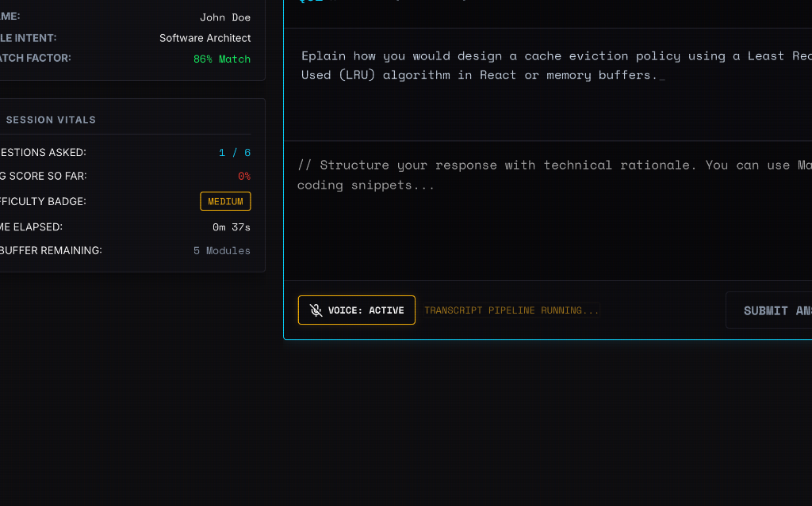
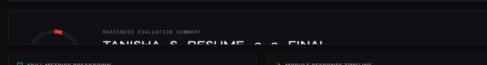

# Hack2Hire: AI-Powered Mock Interview Platform

Hack2Hire is a production-grade mock interview simulator that models the behavior of a senior engineering manager. It uses dynamic LLM-based prompting to assess technical candidates in real-time under adaptive difficulty constraints, strict pacing limits, and automatic exit conditions.

---

### The Problem It Solves
Technical candidates struggle to practice for interviews under realistic, high-pressure constraints that mimic the adaptive questioning of senior engineering managers. Hack2Hire solves this by providing a premium digital terminal where an AI interviewer adapts difficulty dynamically in real-time, penalizes slow responders, and evaluates answers on technical depth and communication clarity.

---

### Tech Stack
* **Frontend**: React (Vite), TypeScript, Custom HSL Hues/CSS Variables
* **Backend**: Node.js, Express, TypeScript, Multer, PDF-Parse
* **AI Engine**: Anthropic Claude API (claude-3-5-sonnet-20241022)
* **Libraries**: jsPDF (Scorecard Exports), Lucide React (HUD Icons)

---

### Key Features
* **Resume Document Extraction**: Seamless server-side PDF text extraction using Multer and pdf-parse, bypassing browser sandboxing limits.
* **Dynamic Profile Calibration**: Automated scanning matching candidates' resumes against target JDs to identify matching skills, estimated experience, and role fit % before starting.
* **Adaptive Questioning**: AI interviewer escalates difficulty to "hard" if candidate answers exceptionally well (scores > 75) and downscales to "easy" if scores drop.
* **Strict Time Constraints**: Circular countdown timer (SVG) turns red and pulses in the last 15s. Running overtime applies a server-side penalty of 0.5 points per second.
* **5-Metric Scoring Engine**: Scores responses out of 100 based on Accuracy (25), Clarity (20), Depth (25), Relevance (20), and Time Efficiency (10).
* **Emergency Termination**: Halts sessions immediately if performance drops below 35% for 3 consecutive questions or if 2 consecutive answers are empty.
* **Hands-free Voice Typing**: Real-time microphone listening via standard browser Speech Recognition API, typing out spoken answers automatically.
* **circular Score Gauge & Sparklines**: Beautiful dashboard showing difficulty trajectory sparklines, chronological timeline reviews, and action plan steps.
* **PDF Report Exporter**: Download the final assessment scorecard as a multi-page PDF document with a single click.

---

### Architecture Diagram



---

### Setup Instructions

#### 1. Clone the repository and install dependencies
```bash
# Clone the repository
git clone https://github.com/tanisinghal0209/Hack2Hire.git
cd Hack2Hire

# Install backend dependencies
cd backend
npm install

# Install frontend dependencies
cd ../frontend
npm install
```

#### 2. Configure Environment Variables
Create a `.env` file in the `backend/` directory:
```env
PORT=5001
ANTHROPIC_API_KEY=your_claude_api_key_here
```
*(If no API key is supplied, Hack2Hire automatically runs in **Simulator Mode** so you can test the entire flow offline.)*

#### 3. Run Development Servers
Start the backend server:
```bash
cd backend
npm run dev
```
*(Starts on `http://localhost:5001`)*

Start the frontend Vite server:
```bash
cd ../frontend
npm run dev
```
*(Starts on `http://localhost:5173`)*

---

### How It Works (5-Step Flow)
1. **Dossier Calibration**: Candidate uploads their resume and pastes a Job Description.
2. **Analysis Handshake**: The engine extracts name, experience, matching skills, and matches qualifications against JD parameters.
3. **Adaptive Question Pipeline**: The platform fires the first question (Technical). The timer starts ticking.
4. **Answer Evaluation**: The candidate types their code or explanation. Upon submission, Claude grades the text and calibrates next question difficulty.
5. **Scorecard Compilation**: Once 6 questions are completed (or early termination is triggered), the system compiles a detailed breakdown with a PDF download option.

---

### Scoring System Explanation

| Criteria | Weight | Notes |
|----------|--------|-------|
| **Accuracy** | 25pts | Factual correctness of statements, coding syntax, and architecture choices. |
| **Clarity** | 20pts | Structured explanation, readability, communication structure, and grammar. |
| **Depth** | 25pts | Highlighting engineering trade-offs, edge-cases, and architectural trade-offs. |
| **Relevance** | 20pts | Focus on the question topic, alignment with job description requirements. |
| **Time Efficiency** | 10pts | Quick responses earn full points. Overtime deducts 0.5 points/sec from total. |

*Note: Answers under 20 words are capped at a maximum score of 5 points.*

---

### Screenshots

#### Configuration & Setup Screen


#### Live Interview Terminal HUD


#### Final Report Card Assessment Dashboard


---

### License
This project is licensed under the MIT License - see the LICENSE file for details.
